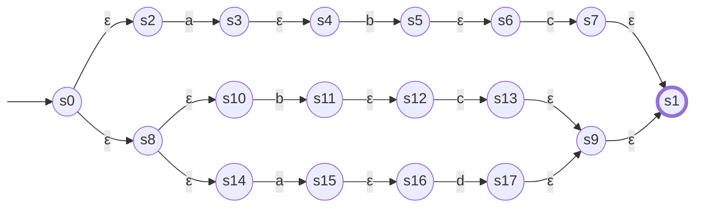
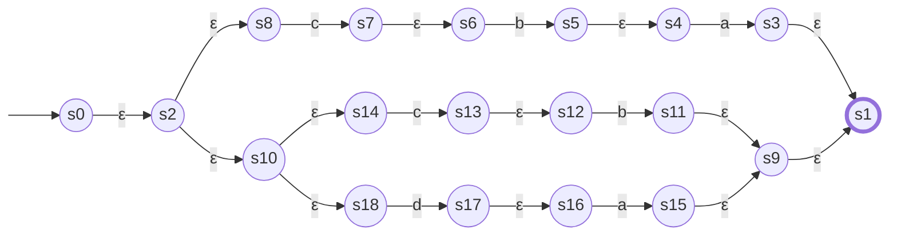
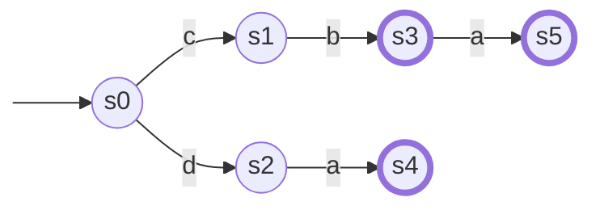
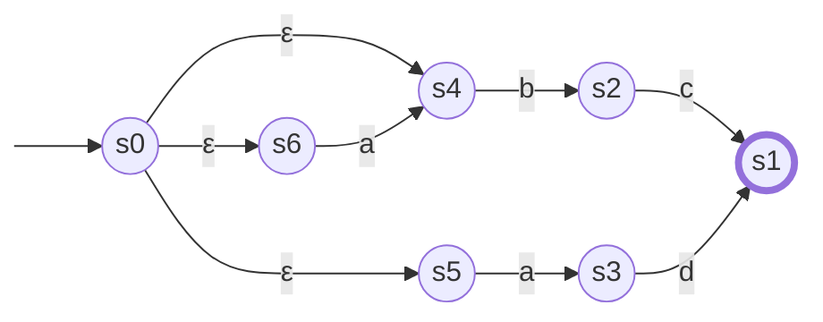
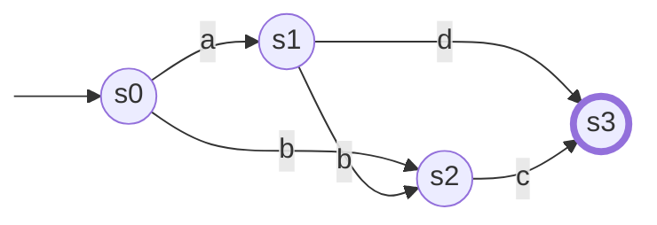
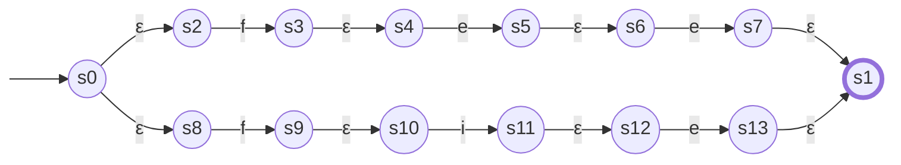
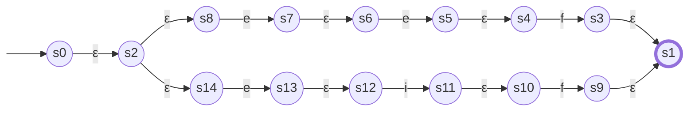
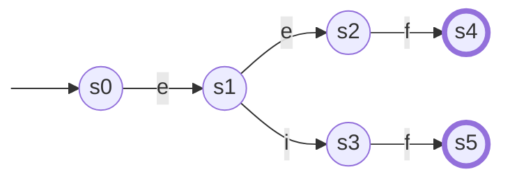
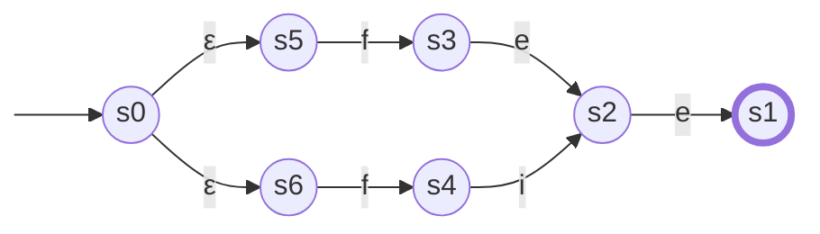
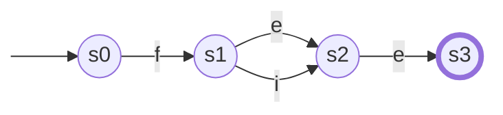

# Brzozowski 构造法

## `abc|bc|ad` to minimal DFA

### to NFA

### reserve(NFA)

### subset(reserve(NFA))

### reserve(subset(reserve(NFA)))

### subset(reserve(subset(reserve(NFA))))

## `fee|fie` to minimal DFA

### to NFA

### reserve(NFA)

### subset(reserve(NFA))

### reserve(subset(reserve(NFA)))

### subset(reserve(subset(reserve(NFA))))

