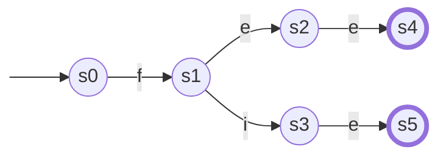
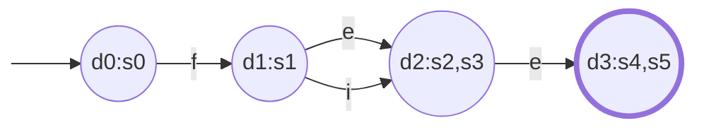
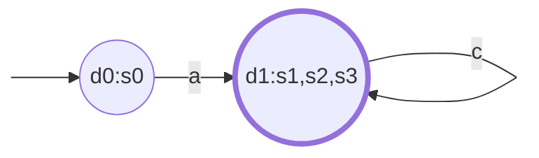
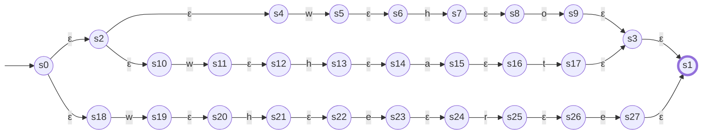
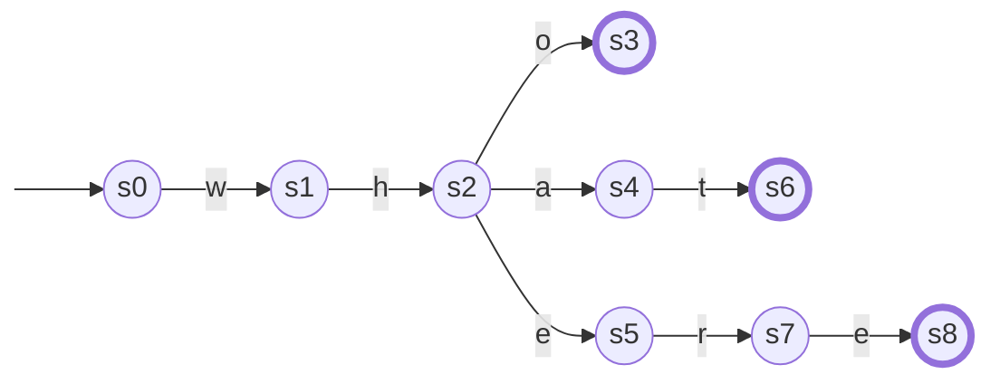
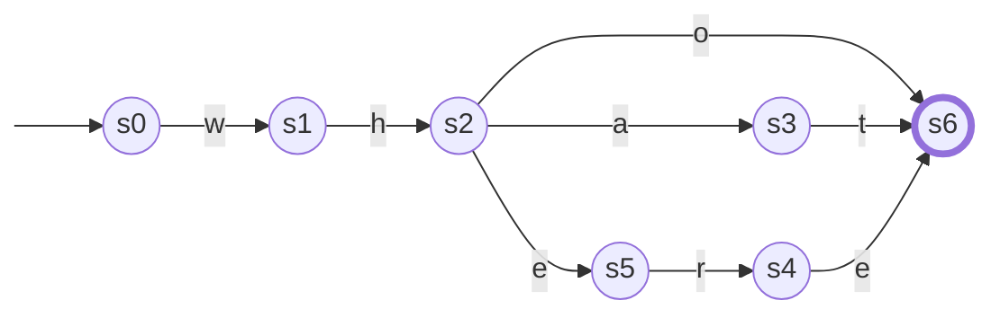
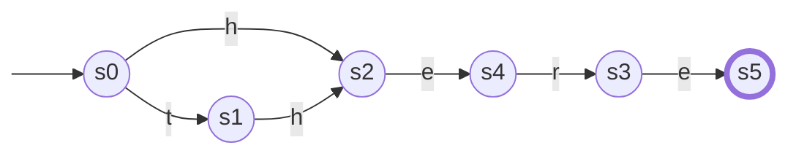

# Hopcroft

## `fee|fie` to DFA

## `fee|fie` to minimal DFA

## `a(b|c)*` to minimal DFA

## `who|what|where` to minimal DFA

### to NFA

### to DFA

### to minimal DFA

## `there|here` to minimal DFA

