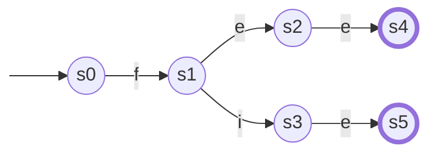

# Hopcroft

## `fee|fie` to DFA

```mermaid

graph LR
classDef start display:none;
classDef isAccept stroke-width:4px;

0:::start
s0((s0))
s1((s1))
s2((s2))
s3((s3))
s4((s4)):::isAccept
s5((s5)):::isAccept

0 --> s0
s0 --f--> s1
s1 --e--> s2
s1 --i--> s3
s2 --e--> s4
s3 --e--> s5

```

