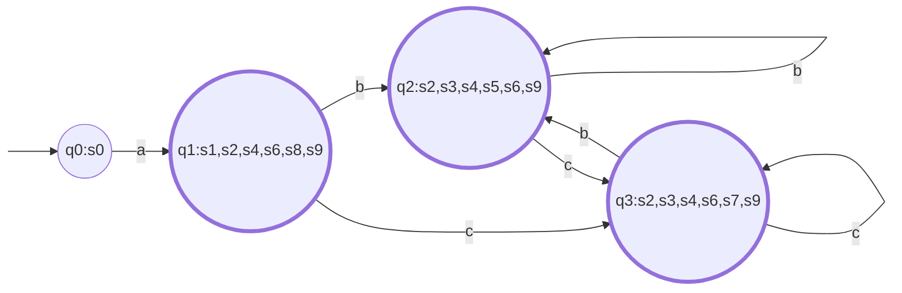

# Subset Construction 子集构造法

## `a(b|c)*` to DFA

```mermaid

graph LR
classDef start display:none;
classDef isAccept stroke-width:4px;

0:::start
q0((q0:s0))
q1((q1:s1,s2,s4,s6,s8,s9)):::isAccept
q2((q2:s2,s3,s4,s5,s6,s9)):::isAccept
q3((q3:s2,s3,s4,s6,s7,s9)):::isAccept

0 --> q0
q0 --a--> q1
q1 --b--> q2
q1 --c--> q3
q2 --b--> q2
q2 --c--> q3
q3 --b--> q2
q3 --c--> q3

```

