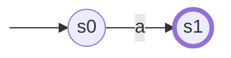
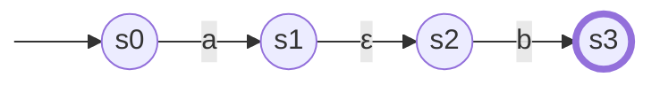
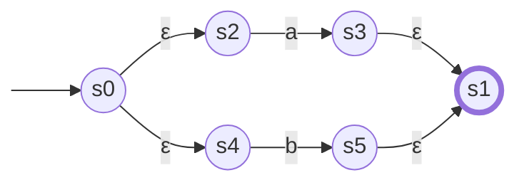
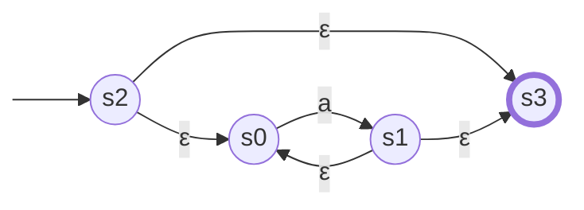
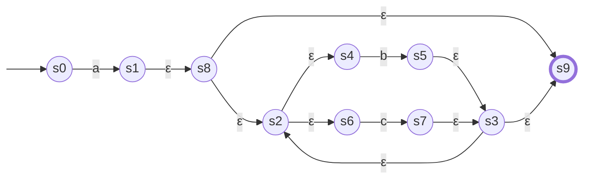

# Thompson

## `a` to NFA

```mermaid

graph LR
classDef start display:none;
classDef isAccept stroke-width:4px;

0:::start
s0((s0))
s1((s1)):::isAccept

0 --> s0
s0 -- a --> s1

```

## `ab` to NFA

```mermaid

graph LR
classDef start display:none;
classDef isAccept stroke-width:4px;

0:::start
s0((s0))
s1((s1))
s2((s2))
s3((s3)):::isAccept

0 --> s0
s0 -- a --> s1
s2 -- b --> s3
s1 -- ε --> s2

```

## `a|b` to NFA

```mermaid

graph LR
classDef start display:none;
classDef isAccept stroke-width:4px;

0:::start
s0((s0))
s1((s1)):::isAccept
s2((s2))
s3((s3))
s4((s4))
s5((s5))

0 --> s0
s2 -- a --> s3
s4 -- b --> s5
s0 -- ε --> s2
s3 -- ε --> s1
s0 -- ε --> s4
s5 -- ε --> s1

```

## `a*` to NFA

```mermaid

graph LR
classDef start display:none;
classDef isAccept stroke-width:4px;

0:::start
s0((s0))
s1((s1))
s2((s2))
s3((s3)):::isAccept

0 --> s2
s0 -- a --> s1
s2 -- ε --> s0
s2 -- ε --> s3
s1 -- ε --> s0
s1 -- ε --> s3

```

## `a(b|c)*` to NFA

```mermaid

graph LR
classDef start display:none;
classDef isAccept stroke-width:4px;

0:::start
s0((s0))
s1((s1))
s2((s2))
s3((s3))
s4((s4))
s5((s5))
s6((s6))
s7((s7))
s8((s8))
s9((s9)):::isAccept

0 --> s0
s0 -- a --> s1
s4 -- b --> s5
s6 -- c --> s7
s2 -- ε --> s4
s5 -- ε --> s3
s2 -- ε --> s6
s7 -- ε --> s3
s8 -- ε --> s2
s8 -- ε --> s9
s3 -- ε --> s2
s3 -- ε --> s9
s1 -- ε --> s8

```

